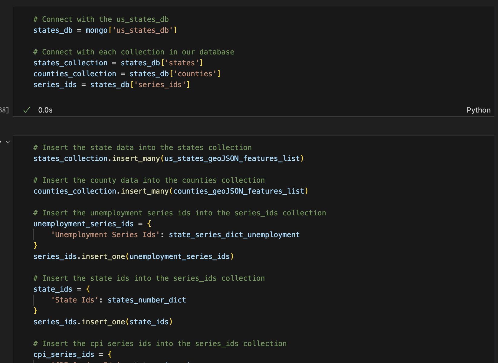

# The Hidden Truth About Covid Project
## Project Overview and Goal
- The ultimate goal of this project is to create a dynamic and interactive dashboard that will allow individuals to explore relationships between historical Covid-19 and economical data for each U.S. state.
- To accomplish this task, we extracted data from various sources, transformed that data into a more usable format, loaded it into a database with the desired structure, hosted that data using our own application programming interface, and then used that data to create a dynmaic interactive online dashboard.
## Tasks and Process
- In order to accomplish our task, we had to first identify data sources that would meet our needs. We identified the John Hopkins Whiting school of engineering as a great source for our Covid data, the bureau of economic analysis for our GDP data, the US census bureau for our population data, US Bureau of Labor Statistics for our unemployment data, and Eric tech for our geojson data.
- Once we had all our data sources, we piped them into our ETL jupyiter notebook for processing. We used the geojson files for state and county as our foundation for our database and then combined the other data sources into the property section of those structures.

- Once we were finished processing the documents, we loaded them into a MongoDB database. We then created a flask app to host the data using our own API.

- Finally, we used HTML, CSS, and JavaScript to create an interactive dashboard using the data we loaded into our database.

## Run Instructions
- Install MongoDB and create a database called us_states_db with the collections states, counties, and series_ids.
- Once you have all of the necessary imports installed, run the ETL.ipynb to load the data into the database.
- Run the flask app to host the data as an API.
- Then run the html in a browser to interact with the dashboard.
- or
- Open the GitHub page located [here](https://bburwinkel0721.github.io/covid_project/)
## Ethical Data Use
- As we did our data collection, we tried to follow our checklist for illegal use of datasets. Most of our datasets originated from a US government source, so they were public domain and free to use. For data sources that were not directly run by the US government, we followed any use guidelines that they required for their data use. We did not use any webscraping of data sources to avoid any complications. Our datasets do not directly involve any one individual, so all of our data does not contain any personally identifiable information for any individual. All of our data sources have been given proper citation.
## [Presentation Link](https://docs.google.com/presentation/d/1-6jFAtXNObbaPopxcbQmAXAUhXvNHklNhyZMqLEYZaE/edit#slide=id.g2ad09d5c6ba_0_253)
## Acknowledgments and Data Sources
- Thank you to Leaflet and Apache ECharts for their various chart tutorials. Thank you to all of the Organizers of our data sources (please see the citations below for specifics).
- [Johns Hopkins Whiting School of Engineering Covid- 19 Github Repository](https://github.com/CSSEGISandData/COVID-19)
    - Citation: Dong E, Du H, Gardner L. An interactive web-based dashboard to track COVID-19 in real time. Lancet Inf Dis. 20(5):533-534. doi: 10.1016/S1473-3099(20)30120-1
- [Bureau of Economic Analysis API ](https://apps.bea.gov/API/signup/?_gl=1*1xk07q5*_ga*MTQ2MTU2MTg5My4xNzE4MjM5ODA3*_ga_J4698JNNFT*MTcxODY2OTAwOC40LjAuMTcxODY2OTAwOC42MC4wLjA.)
    - Citation: Bureau of Economic Analysis. (2024). API signup. Retrieved June 22, 2024, from `https://apps.bea.gov/API/signup/?_gl=1*1xk07q5*_ga*MTQ2MTU2MTg5My4xNzE4MjM5ODA3*_ga_J4698JNNFT*MTcxODY2OTAwOC40LjAuMTcxODY2OTAwOC42MC4wLjA`
- [United States Census Bureau Population Dataset](https://www.census.gov/data/tables/time-series/demo/popest/2020s-state-total.html)
    - Citation: U.S. Census Bureau. (2024). National population totals and components of change: 2020-2023. Retrieved June 22, 2024, from `https://www.census.gov/data/tables/time-series/demo/popest/2020s-state-total.html`
- [Eric Tech US States and Counties GeoJSON](https://eric.clst.org/tech/usgeojson/)
    - Citation: Cowgill, E. (2024). US GeoJSON data. Retrieved June 22, 2024, from `https://eric.clst.org/tech/usgeojson`
- [Leaflet Choropleth](https://leafletjs.com/examples/geojson/)
    - Leaflet. (2024). Choropleth Example. Retrieved June 22, 2024, from `https://leafletjs.com/examples/choropleth`
- [Apache ECharts Examples](https://echarts.apache.org/examples/en/index.html)
    - Apache ECharts. (2024). ECharts Examples. Retrieved June 22, 2024, from `https://echarts.apache.org/examples/en/index.html`
- [U.S. Bureau of Labor Statistics Public API](https://www.bls.gov/developers/home.htm)
    - Citation: U.S. Bureau of Labor Statistics. (2024). BLS developers home. Retrieved June 22, 2024, from `https://www.bls.gov/developers/home.htm`
- [World Bank Group GDP Data](https://data.worldbank.org/indicator/NY.GDP.MKTP.CD?end=2022&locations=PR&start=2018)
    - Citation: World Bank. (n.d.). GDP (current US$) - Puerto Rico. Retrieved June 22, 2024 from `https://data.worldbank.org/indicator/NY.GDP.MKTP.CD?end=2022&locations=PR&start=2018`
    
